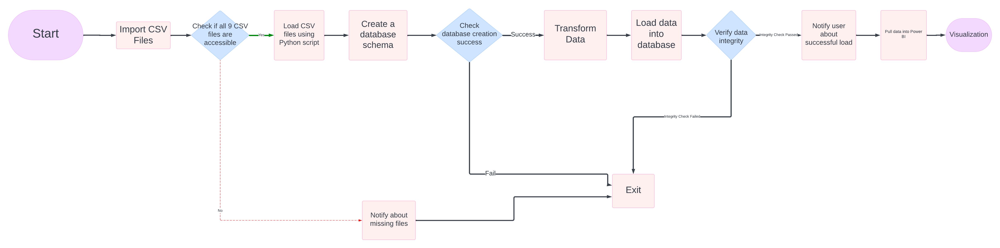
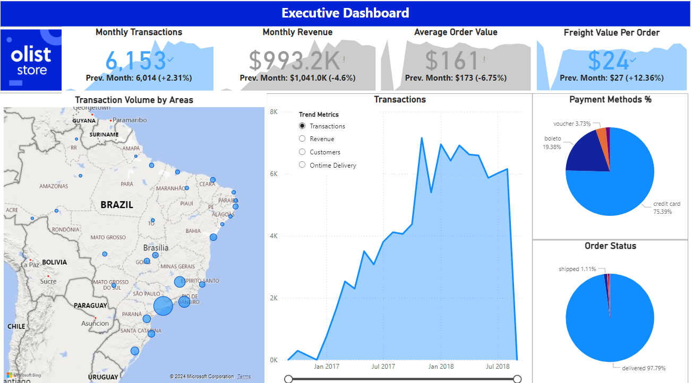
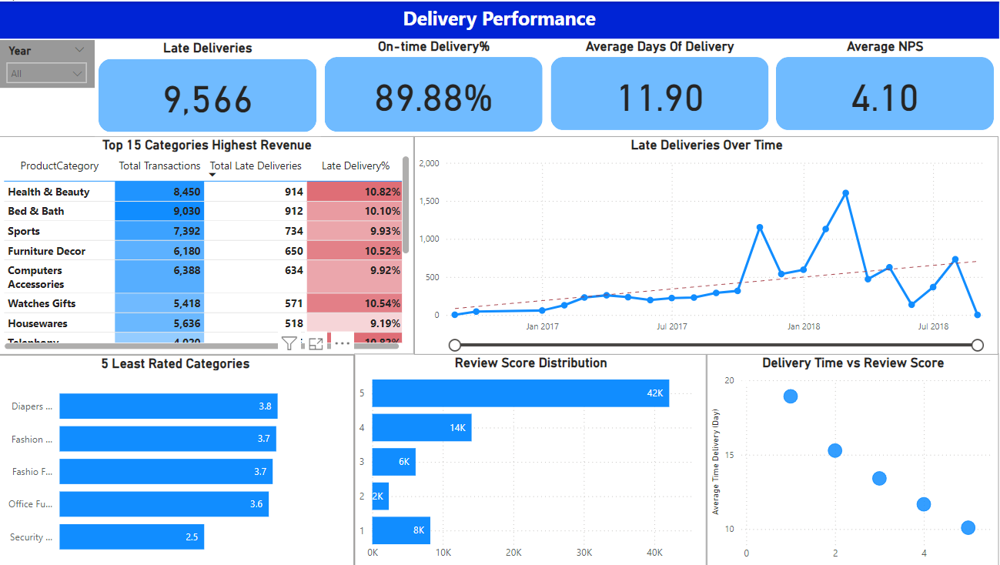
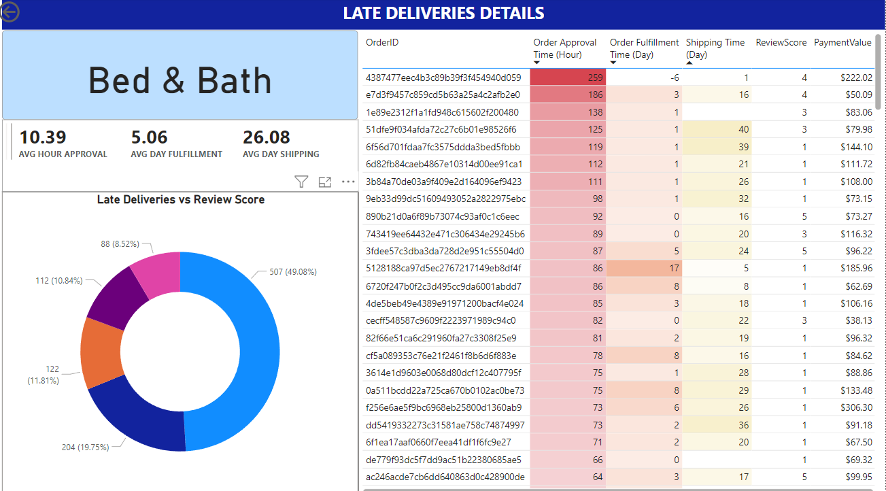

<!-- PROJECT SHIELDS -->
<!--
*** I'm using markdown "reference style" links for readability.
*** Reference links are enclosed in brackets [ ] instead of parentheses ( ).
*** See the bottom of this document for the declaration of the reference variables
*** for contributors-url, forks-url, etc. This is an optional, concise syntax you may use.
*** https://www.markdownguide.org/basic-syntax/#reference-style-links
-->

[![LinkedIn][linkedin-shield]][linkedin-url] 

<!-- PROJECT LOGO -->
 

  

<h3 align="center">End-to-End Business Analytics: Building a Data Warehouse and Dynamic Dashboard Solution</h3>

  

    The project includes ETL process, Datawarehouse design, Pull data from a data warehouse to BI platform & design an interactive and insightful dashboards for business users.
     

  

<!-- TABLE OF CONTENTS -->

  
Table of Contents

  <ol>
    <li>
      <a href="#about-the-project">About The Project</a>
      <ul>
        <li><a href="#built-with">Built With</a></li>
        <li><a href="#folders">Folders structure</a></li>
      </ul>
    </li>
    <li>
      <a href="#getting-started">Getting Started</a>
    <li>
        <a href="#data-pipeline-diagram"> Data Pipeline Diagram</a>
    <li>
        <a href="#dashboards"> Dashboards</a>
    <li>
        <a href="#contact"> Contact</a> 
  </ol>

<!-- ABOUT THE PROJECT -->
## About The Project

<!-- [![Product Name Screen Shot][product-screenshot]](https://example.com)-->

This project leverages a real-world Brazilian e-commerce dataset provided by **O'list** to analyze and visualize sales performance metrics. The dataset, comprising over 100,000 orders from 2016 to 2018, offers insights into overall sales & delivery performance.

**Data Processing and Analysis**

To prepare the data for analysis, I performed the following steps:

1. Extracting: Extracted 9 csv files from source 
2. Loading: Loaded each file into a pre-defined table in a database.
2. Normalization: Standardized data formats and cleaned inconsistencies to ensure data quality.
3. Data Warehousing: Populated tables in data warehouse with a Snowflake schema for efficient querying and analysis.

**!Note:** Data Quality Assessment will be implemented in the next phase of this project.

**Visualization and Insights**

Using Power BI, I transformed data & developed interactive dashboards that showcase key sales/orders metrics including:

- Sales Performance: Monthly Transactions, Revenue, Average Order Value & Freight Value Per Order.
- Delivery Performance: Total Late Deliveries, On-time Delivery Rate, Average Days of Delivery and Average NPS. 

These visualizations provide valuable insights for business stakeholders to make data-driven decisions and identify opportunities for growth.

(<a href="#readme-top">back to top</a>)

### Built With

* [![Python][Python]][Python-url]
* [![MySQL][MySQL]][MySQL-url]
* 

(<a href="#readme-top">back to top</a>)

### Folder Structure 

In the repo, there are 3 folders:
<ol> 
<li> Olist: Dataset source - 9 csv files.
<li> Scripts: Contains 4 files, 3 .sql files and 1 .py file
<ul> 
    <li> OLTP_tables_create: Online Transaction Processing Tables.
    <li> DWH_tables_create: Define Dimension and Fact tables.
    <li> views_create: Define views in order to efficiently read performance if concurrent readingn occurs. <em>(However, I will not use these views to pull data from PowerBI)</em> 
    <li> transform_load_scripts: the script to join between tables and populate the Dim/Fact Tables. This file will be read by the file load_script.py 
</ul>
<li> diagrams: diagrams of OLTP and DWH in database and data pipeline architecture.
</ol>

(<a href="#readme-top">back to top</a>)

<!-- GETTING STARTED -->
## Getting Started

To view the PowerBI Dashboards in this repository, it's required Power BI Desktop installed. You can download the application for free on [PowerBI Desktop](https://www.microsoft.com/en-us/power-platform/products/power-bi/desktop).

Once successfully installed, download a dashboard file with extension .pbix. Then, open it and start exploring the dashboard.

## Data Pipeline Diagram

## Dashboard

### Preview 

[**Click to download the file**](./Dashboard/)

<!-- CONTACT -->
## Contact

I am open to discussion/feedback on how to effectively display dashboard to improve business users' engagements. Please reach out to me via

Abi - discord: abivu711 - email: vu.ab.159@gmail.com

(<a href="#readme-top">back to top</a>)

<!-- MARKDOWN LINKS & IMAGES -->
<!-- https://www.markdownguide.org/basic-syntax/#reference-style-links -->

[linkedin-shield]: https://img.shields.io/badge/-LinkedIn-black.svg?style=for-the-badge&logo=linkedin&colorB=555
[linkedin-url]: https://www.linkedin.com/in/abi-vu/
[product-screenshot]: images/screenshot.png
[Python]: https://img.shields.io/badge/python-3670A0?style=for-the-badge&logo=python&logoColor=ffdd54
[Python-url]: https://www.python.org/
[MySQL]: https://shields.io/badge/MySQL-lightgrey?logo=mysql&style=plastic&logoColor=white&labelColor=blue
[MySQL-url]: https://www.mysql.com/
